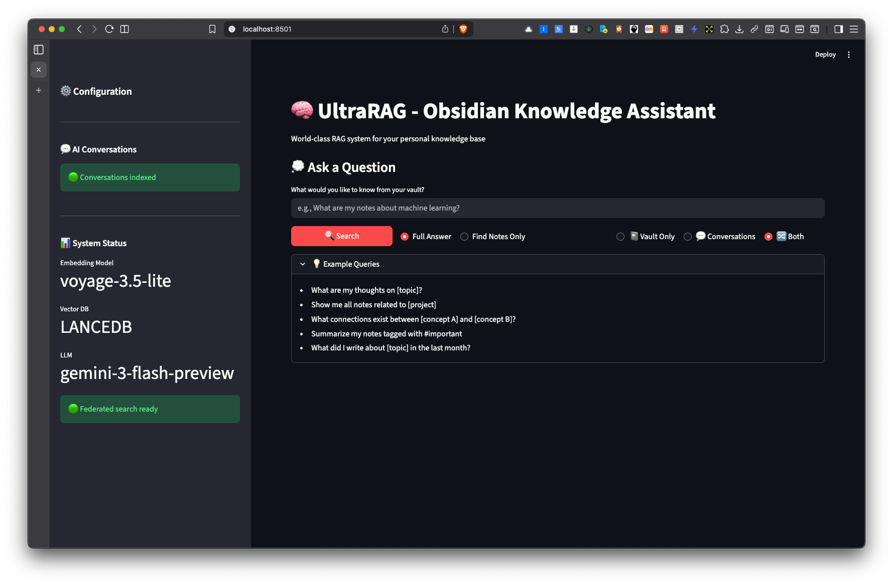

# UltraRAG - World-Class RAG for Obsidian Vaults

A sophisticated Retrieval-Augmented Generation (RAG) system specifically designed for personal Obsidian knowledge bases. Implements state-of-the-art techniques from 2024-2025 research including semantic chunking, hybrid retrieval, graph-based search, self-correcting retrieval, iterative research mode, and advanced reranking.



## Features

### Phase 1: Core RAG (Implemented)
- ✅ **Smart Document Loading**: Parses Obsidian markdown with frontmatter, wikilinks, and tags
- ✅ **Advanced Chunking**: Markdown-aware semantic chunking with configurable strategies
- ✅ **Late Chunking**: 10-12% better retrieval accuracy by preserving document-level context
- ✅ **Multiple Embedding Options**:
  - Voyage-3-large (best quality)
  - Qwen3-Embedding-8B (best open-source)
  - OpenAI text-embedding-3-large
- ✅ **Vector Database Support**: LanceDB (embedded) or Qdrant (scalable)
- ✅ **Advanced Reranking**: Voyage Rerank 2, Jina v2, or Cohere
- ✅ **Hybrid Retrieval**: Vector + query fusion for better results
- ✅ **Query Transformation**: HyDE, Multi-Query expansion, or both for significantly better retrieval
- ✅ **PTCF Prompting**: Research-backed prompt engineering for Gemini 3 Flash
- ✅ **Wikilink Graph**: Builds knowledge graph from note connections
- ✅ **AI Conversations RAG**: Federated search across your vault AND past AI conversations (ChatGPT, Claude, Gemini)
- ✅ **Inline Citations**: Clickable `[1]`, `[2]`, `[3]` citations that link to sources

### Phase 2: Production Features (Implemented)
- ✅ **Streamlit Web Interface**: Full-featured web UI with federated search
- ✅ **Query Caching**: LRU cache for faster repeated queries
- ✅ **Incremental Indexing**: Checkpoint-based recovery for large vaults
- ✅ **Wikilink Graph Retrieval**: Traverse note connections for related content

### Phase 3: Advanced Features (Implemented)
- ✅ **Research Mode**: Iterative multi-step retrieval with LLM-powered gap analysis (Khoj-inspired, 141% accuracy improvement)
- ✅ **Self-Correction**: Self-RAG/CRAG patterns with relevance grading and query refinement
- ✅ **RAGAS Evaluation**: Automated evaluation framework with faithfulness, relevancy, precision, and recall metrics
- ✅ **RAPTOR Summaries**: Hierarchical document summaries for better context
- ✅ **Temporal Filtering**: Filter by creation/modification date
- 🔄 Neo4j graph database (deferred - in-memory graph sufficient for most use cases)

## Installation

### Prerequisites
- Python 3.10+
- Your Obsidian vault path
- API keys (optional, depending on model choice)

### Quick Start

1. **Clone and setup**
```bash
cd /path/to/UltraRAG
python3 -m venv venv
source venv/bin/activate  # On Windows: venv\Scripts\activate
pip install -r requirements.txt
```

2. **Configure environment**
```bash
cp .env.example .env
# Edit .env with your settings:
# - OBSIDIAN_VAULT_PATH=/path/to/your/vault
# - VOYAGE_API_KEY=your_key (for Voyage embeddings/reranking)
# - GOOGLE_API_KEY=your_key (for Gemini LLM)
```

3. **Run the system**
```bash
python main.py
```

## Configuration

Edit `.env` to customize:

### Embedding Models
```bash
# Best quality (recommended)
EMBEDDING_MODEL=voyage-3-large
VOYAGE_API_KEY=your_key

# Best open-source (free, self-hosted)
EMBEDDING_MODEL=qwen3-8b

# Budget option (free API)
EMBEDDING_MODEL=openai-3-large
GOOGLE_API_KEY=your_key  # Use Gemini embeddings
```

### Vector Database
```bash
# Embedded (no setup required)
VECTOR_DB=lancedb
LANCEDB_PATH=./data/lancedb

# Production (requires Qdrant server)
VECTOR_DB=qdrant
QDRANT_HOST=localhost
QDRANT_PORT=6333
```

### Retrieval Settings
```bash
CHUNK_SIZE=512              # Optimal for mixed content
CHUNK_OVERLAP=75            # 15% overlap
TOP_K=75                    # Initial retrieval candidates
RERANK_TOP_N=10            # Final results after reranking
ENABLE_HYBRID_SEARCH=true  # Use query fusion

# Query transformation for better retrieval
QUERY_TRANSFORM_METHOD=hyde  # Options: hyde, multi_query, both, none
QUERY_TRANSFORM_NUM_QUERIES=3  # Number of query variations (for multi_query/both)

# Self-correction (Self-RAG/CRAG patterns)
USE_SELF_CORRECTION=true       # Enable self-correcting retrieval
SELF_CORRECTION_MAX_RETRIES=2  # Max retry attempts with refined queries

# Research Mode (iterative retrieval)
ENABLE_RESEARCH_MODE=true           # Enable @research prefix and 🔬 checkbox
RESEARCH_MAX_ITERATIONS=3           # Max retrieval iterations
RESEARCH_CONFIDENCE_THRESHOLD=0.8   # Stop when confidence exceeds this
RESEARCH_MAX_SUBQUERIES=3           # Sub-queries per iteration
```

### Chunking Strategies

Choose your chunking strategy based on accuracy vs. speed requirements:

```bash
# Available strategies:
# - obsidian_aware: Structure-preserving (recommended for Obsidian)
# - markdown_semantic: Markdown + semantic splitting
# - late_chunking: Best accuracy (+10-12%), slower indexing
# - semantic: Pure semantic chunking
# - simple: Fast, basic sentence splitting

CHUNKING_STRATEGY=obsidian_aware  # Default

# For best retrieval accuracy, use late_chunking:
CHUNKING_STRATEGY=late_chunking
LATE_CHUNKING_ALPHA=0.7  # 0.7 = 70% local, 30% global context
```

**Late Chunking** (NEW):
- **10-12% better retrieval accuracy** than standard chunking
- Preserves document-level context in each chunk embedding
- Combines local chunk semantics with global document context
- Trade-off: 2x slower indexing (requires embedding both document and chunks)
- Recommended for: High-accuracy retrieval when indexing time is not critical

See [docs/features/LATE_CHUNKING.md](docs/features/LATE_CHUNKING.md) for detailed documentation.

### Query Transformation Methods

Query transformation significantly improves retrieval by bridging the query-document vocabulary gap:

**HyDE (Hypothetical Document Embeddings)** - Default, recommended
- Generates a hypothetical answer to your question
- Embeds the answer instead of the query
- Since answers resemble documents more than queries, this improves matching
- Best for: Most queries, especially complex questions

**Multi-Query Expansion**
- Generates 3-5 variations of your query from different perspectives
- Retrieves with all variations and combines results
- Uses reciprocal rank fusion for score aggregation
- Best for: Broad topics, exploratory search

**Both (HyDE + Multi-Query)**
- Combines both techniques for maximum recall
- Generates query variations, then creates hypothetical documents for each
- Most comprehensive but slower and uses more API credits
- Best for: Critical queries where you need best possible results

**None/Disabled**
- Direct query embedding without transformation
- Fastest but lower quality retrieval
- Best for: When speed matters more than quality

### Research Mode

Research mode enables iterative, multi-step retrieval with LLM-powered gap analysis. Inspired by Khoj's research mode (141% accuracy improvement on benchmarks).

**How It Works:**
1. Initial retrieval with your query
2. LLM analyzes gaps in retrieved content ("What information is still missing?")
3. Generates refined sub-queries for missing information
4. Retrieves again with sub-queries (up to `max_iterations`)
5. Aggregates and deduplicates results across all iterations
6. Synthesizes comprehensive answer from all retrieved content

**Usage:**
- **CLI**: Prefix query with `@research` - e.g., `@research what are all the productivity techniques in my notes?`
- **Web UI**: Check the 🔬 "Research Mode" checkbox before querying

**Configuration:**
```bash
ENABLE_RESEARCH_MODE=true           # Enable research mode (default: true)
RESEARCH_MAX_ITERATIONS=3           # Max iterations (default: 3)
RESEARCH_CONFIDENCE_THRESHOLD=0.8   # Stop when confident (default: 0.8)
RESEARCH_MAX_SUBQUERIES=3           # Sub-queries per iteration (default: 3)
```

**Best For:**
- Comprehensive research queries: "What are ALL the X in my notes?"
- Topic synthesis: "Everything I know about habit formation"
- Cross-reference queries: "How do my notes on X relate to Y?"

### Self-Correction (Self-RAG/CRAG)

Self-correction implements Self-RAG and CRAG patterns to improve retrieval quality through automatic query refinement.

**How It Works:**
1. Initial retrieval with your query
2. LLM grades relevance: `CORRECT`, `AMBIGUOUS`, or `INCORRECT`
3. If not `CORRECT`: LLM refines query and re-retrieves
4. Repeats up to `max_retries` times
5. Returns best results from all attempts

**Configuration:**
```bash
USE_SELF_CORRECTION=true       # Enable self-correction (default: true)
SELF_CORRECTION_MAX_RETRIES=2  # Max refinement attempts (default: 2)
```

See [docs/features/SELF_CORRECTION.md](docs/features/SELF_CORRECTION.md) for detailed documentation.

### Inline Citations

UltraRAG generates responses with inline citations that link to sources:
- Citations appear as `[1]`, `[2]`, `[3]` in the response text
- In the web UI, clicking a citation scrolls to that source
- Sources are numbered consistently between response and source list

**Example:**
> "Atomic habits work because small changes compound over time [1]. The habit loop consists of cue, routine, and reward [3]."

## AI Conversations Integration

UltraRAG can index and search your past AI conversations alongside your Obsidian vault using **federated retrieval**. This means you can query both your personal notes AND your ChatGPT/Claude/Gemini conversation history in a single search.

### Setup

1. **Export your AI conversations** using [AI Conversation Toolkit](https://github.com/silver-gr/ai-conversation-toolkit)

2. **Configure UltraRAG** to use your exports:
```bash
# In your .env file
CONVERSATIONS_ENABLED=true
CONVERSATIONS_PATH=/path/to/ai-conversation-toolkit/output
CONVERSATIONS_WEIGHT=0.8  # Score weight vs vault (vault=1.0)
```

3. **Index and search**:
   - **CLI**: Type `conv` to index conversations, then use `@vault`, `@conv`, or `@all` prefixes
   - **Web**: Click "Index Conversations" in sidebar, then use the search scope toggle

### Search Scopes

| Prefix | Scope | Description |
|--------|-------|-------------|
| (none) | Both | Federated search across vault + conversations |
| `@vault` | Vault only | Search only your Obsidian notes |
| `@conv` | Conversations | Search only AI conversation history |
| `@all` | Both | Explicit federated search |

Results are tagged with 📓 (vault) or 💬 (conversation) so you know the source.

## Usage

### Command Line Interface

```bash
python main.py
```

This will:
1. Load your Obsidian vault
2. Index all notes (one-time process)
3. Start interactive query loop

### Python API

```python
from main import UltraRAG

# Initialize system
rag = UltraRAG()

# Index your vault (one-time)
rag.index_vault()

# Query the system
result = rag.query("What are my thoughts on machine learning?")
print(result['answer'])

# View sources
for source in result['sources']:
    print(f"{source['title']}: {source['score']}")

# Search without generation
notes = rag.search_notes("project ideas", top_k=5)
```

## Architecture

```
┌─────────────────┐
│ Obsidian Vault  │
└────────┬────────┘
         │
    ┌────▼─────┐
    │  Loader  │  Extracts wikilinks, tags, metadata
    └────┬─────┘
         │
    ┌────▼─────┐
    │ Chunker  │  Markdown-aware semantic splitting
    └────┬─────┘
         │
    ┌────▼─────────┐
    │  Embeddings  │  Voyage-3 / Qwen3 / OpenAI
    └────┬─────────┘
         │
    ┌────▼──────────┐
    │ Vector Store  │  LanceDB / Qdrant
    └────┬──────────┘
         │
    ┌────▼─────────┐
    │  Retrieval   │  Hybrid vector + graph search
    └────┬─────────┘
         │
    ┌────▼─────────┐
    │  Reranking   │  Voyage Rerank 2 / Jina v2
    └────┬─────────┘
         │
    ┌────▼──────────┐
    │  Generation   │  Gemini 3 Flash + PTCF prompts
    └───────────────┘
```

## Cost Analysis

### One-time Indexing (1,650 notes ~404MB)
- **Voyage-3-large**: $13-40 (API pricing)
- **Qwen3-8B**: Free (self-hosted, requires 16-32GB VRAM)
- **OpenAI**: ~$13
- **Time**: 10-30 minutes depending on model

### Ongoing Usage
- **Per query**: $0.001-0.01 (with reranking)
- **Monthly (moderate use)**: $5-20
- **Self-hosted**: $0 after hardware investment

## Performance

Expected metrics on a 1,650-note vault:

| Metric | Target | Notes |
|--------|--------|-------|
| Retrieval Accuracy | 85-95% | vs 40-50% for naive RAG |
| Latency (simple) | <1s | Single hop retrieval |
| Latency (complex) | <3s | Multi-hop + reranking |
| Index Time | 10-30min | One-time operation |
| Scale | 10K+ notes | No architecture changes needed |

## Roadmap

### Phase 1: ✅ Core RAG
- [x] Document loading and parsing
- [x] Semantic chunking
- [x] Vector indexing
- [x] Basic retrieval
- [x] LLM integration
- [x] Inline citations with clickable links

### Phase 2: ✅ Production Features
- [x] Streamlit web interface
- [x] Query caching
- [x] Incremental indexing with checkpoints
- [x] Wikilink graph retrieval
- [x] AI conversations federated search

### Phase 3: ✅ Advanced Features
- [x] Research Mode (iterative retrieval with gap analysis)
- [x] Self-Correction (Self-RAG/CRAG patterns)
- [x] RAGAS evaluation framework
- [x] RAPTOR hierarchical summaries
- [x] Temporal filtering
- [ ] Neo4j graph database (deferred - in-memory graph sufficient)

## Troubleshooting

### "VOYAGE_API_KEY not found"
Get a free API key from [Voyage AI](https://www.voyageai.com/)

### "Out of memory" during indexing
- Use smaller embedding model (Qwen3-1.5B variant)
- Reduce batch size in chunking
- Use LanceDB instead of Qdrant

### Slow query performance
- Enable reranking (`RERANK_TOP_N=10`)
- Reduce `TOP_K` (try 50 instead of 75)
- Use faster embedding model

### Poor retrieval quality
- Increase `TOP_K` (try 100)
- Adjust `CHUNK_SIZE` (try 768)
- Enable hybrid search
- Add reranking

## Contributing

This is a personal project implementing research from the compass_artifact document. Feel free to adapt for your own use case.

## License

MIT License - See LICENSE file

## Documentation

Full documentation is available in the [`docs/`](docs/) folder:

- [Quick Start Guide](docs/QUICKSTART.md)
- [Architecture Overview](docs/ARCHITECTURE.md)
- [Testing Guide](docs/TESTING.md)
- [RAGAS Evaluation Guide](docs/EVALUATION.md)
- **Feature Guides**: [Late Chunking](docs/features/LATE_CHUNKING.md) | [Query Transformation](docs/features/QUERY_TRANSFORMATION.md) | [Self-Correction](docs/features/SELF_CORRECTION.md) | [Graph Retrieval](docs/features/GRAPH_RETRIEVAL.md)

## Acknowledgments

Based on cutting-edge RAG research from 2024-2025:
- RAPTOR (recursive abstractive processing)
- Late Chunking (Jina AI)
- Self-RAG and CRAG (corrective retrieval)
- Khoj Research Mode (iterative retrieval)
- Voyage AI embeddings and reranking
- RAGAS evaluation framework
- Gemini 3 Flash
- LlamaIndex framework

---

**Built with ❤️ for Obsidian power users**
